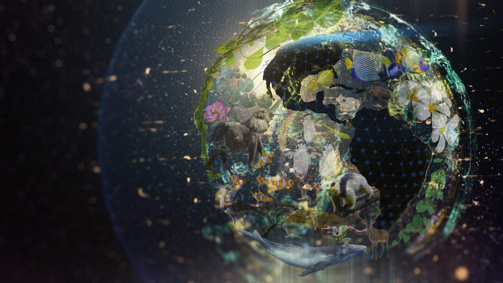

::: {.center-text}
{width="80%" fig-alt="Alt text here."}
::: 

::: {.center-text .gray-text}
*Image source: [NCEAS](https://www.nceas.ucsb.edu/news/closing-gap-how-nceas-using-ai-unlock-full-potential-biodiversity-monitoring){target="_blank}* 
::: 

## Description 

The MEDS AI for Environmental Data Science Workshop Series aims to guide students on using generative AI tools thoughtfully and professionally, without replacing the core skills needed to succeed as an environmental data scientist. Workshops are scaffolded across the program, with an early emphasis on building core competencies, then guided AI use as skills develop.

Students will learn to engage with AI in ways that are **critical**, **responsible**, and **efficient**. The goal is to prepare students to navigate AI use confidently across coursework, job interviews, and professional settings.

## Workshop Materials

|  Quarter |  Slides |  Supplemental Materials |  Description |
|----|------------------------------------------------------------------------------------------|--------------------------------------------------------------|---------------------------------------------------|
| Summer | [Teach Me How to Google](https://ucsb-meds.github.io/teach-me-how-to-google/#/title-slide){target="_blank"}  | *NA* | The case for debugging & search skills in the age of AI + tips on how to do so effectively |
| Winter | [AI for EDS: Intro to LLMs & Prompting Fundamentals](https://docs.google.com/presentation/d/16vvfAapf7x4q9i5nns_cTjlNzAWn0x_QTmL5NwDxWIY/edit?usp=sharing){target="_blank"}  | [GenAI demo binder](https://github.com/carmengg/code-for-genAI-demo?tab=readme-ov-file#whats-in-this-repo){target="_blank"} | An introduction to large language models (LLMs), their environmental and ethical considerations, and how to write effective prompts |
| Winter | [AI for EDS: GitHub Copilot & Reproducible Python Projects](https://docs.google.com/presentation/d/1BteWC30xfnUwh08afK6biUA-iLiqe6Vk9N-vFDLIdFg/edit?usp=sharing){target="_blank"}  | [GitHub Copilot demo repo](https://github.com/UCSB-MEDS/AI-for-EDS-workshop-2){target="_blank"} | An introduction to GitHub Copilot, best practices for responsible use, and practical tips for integrating it into your workflow |
: {.hover .bordered tbl-colwidths="[10,20,20,50]"}

## Contributors

These workshop materials were developed by [Carmen Galaz García](https://bren.ucsb.edu/people/carmen-galaz-garcia-0){target="_blank"} (Bren Teaching Faculty), [Kat Le](https://bren.ucsb.edu/people/kat-le){target="_blank"} (Technical Applications Manager), and [Sam Shanny-Csik](https://bren.ucsb.edu/people/samantha-shanny-csik){target="_blank"} (Data Science Programs Manager & Lecturer). We draw on materials and approaches from a variety of sources, leaning heavily on discussions with other Bren Faculty and education efforts by folks at [NCEAS](https://www.nceas.ucsb.edu/){target="_blank"} and the [UCSB Office of Teaching and Learning](https://otl.ucsb.edu/cop/artificial-intelligence-community-practice){target="_blank"}. 

<!-- ## Course Description

Add your course description here (can be copied over from your syllabus or the affiliated Bren course page)

## Teaching Team

<br> -->

<!-- Create responsive grid with two columns, which stack vertically when browser window is made smaller (or when viewed on a mobile device) -->

<!-- ::: {.grid}

::: {.g-col-12 .g-col-md-6}
::: {.center-text .body-text-l}
**Instructor**
:::
```{r}
#| eval: true 
#| echo: false
#| fig-align: "center"
#| out-width: "45%" 

```
::: {.center-text}
[**Instructor's Name**]{.teal-text}  
**Email:** [email@ucsb.edu](mailto::email@bren.ucsb.edu)  
**Learn more:** link to preferred online profile here  
:::
:::

::: {.g-col-12 .g-col-md-6}
::: {.center-text .body-text-l}
**TA**
:::
```{r}
#| eval: true 
#| echo: false
#| fig-align: "center"
#| out-width: "45%" 

```
::: {.center-text}
[**TA's Name**]{.teal-text}  
**Email:** [email@bren.ucsb.edu](mailto::email@bren.ucsb.edu)   
**Learn more:** link to preferred online profile here
:::
:::

::: -->

<!-- ## Acknowledgements

Add any acknowledgements here (e.g. any resources or people you drew lots of inspiration or help from when building your materials?) -->
