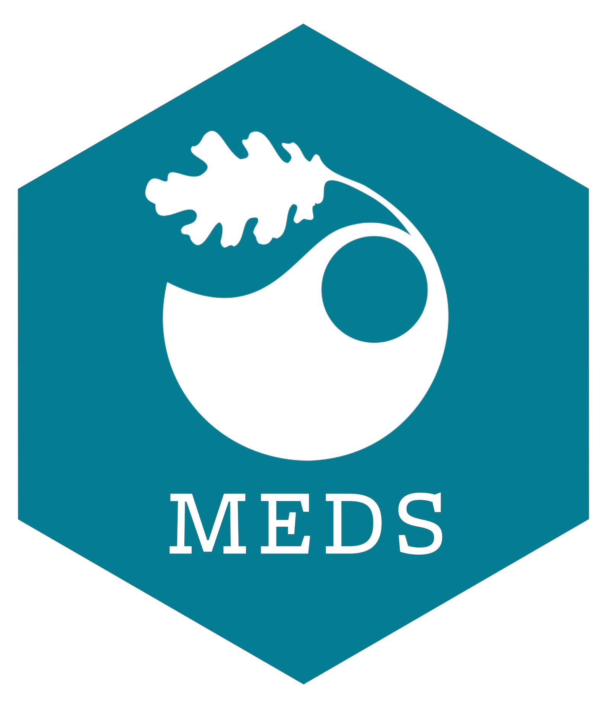

::: {.center-text}
{width="25%" fig-alt="Alt text here."}
:::

<!-- ::: {.center-text .gray-text}
*Add your own relevant image to the `images/` folder, then update the file name in `index.qmd` so that it points to the correct image.* 
::: -->

<br>

|  Slides |  Supplemental Materials |  Description |
|------------------------------------------------------------------------------------------|--------------------------------------------------------------|---------------------------------------------------|
| [Teach Me How to Google](https://ucsb-meds.github.io/teach-me-how-to-google/#/title-slide){target="_blank"}  | *NA* | The case for debugging & search skills in the age of AI + tips on how to do so effectively |
| [AI Workshop #1](https://docs.google.com/presentation/d/16vvfAapf7x4q9i5nns_cTjlNzAWn0x_QTmL5NwDxWIY/edit?usp=sharing){target="_blank"}  | tbd | tbd |
| [AI Workshop #2](https://docs.google.com/presentation/d/1BteWC30xfnUwh08afK6biUA-iLiqe6Vk9N-vFDLIdFg/edit?usp=sharing){target="_blank"}  | tbd | tbd |
: {.hover .bordered tbl-colwidths="[25,25,50]"}


<!-- ## Course Description

Add your course description here (can be copied over from your syllabus or the affiliated Bren course page)

## Teaching Team

<br> -->

<!-- Create responsive grid with two columns, which stack vertically when browser window is made smaller (or when viewed on a mobile device) -->

<!-- ::: {.grid}

::: {.g-col-12 .g-col-md-6}
::: {.center-text .body-text-l}
**Instructor**
:::
```{r}
#| eval: true 
#| echo: false
#| fig-align: "center"
#| out-width: "45%" 
knitr::include_graphics("images/tbd.png")
```
::: {.center-text}
[**Instructor's Name**]{.teal-text}  
**Email:** [email@ucsb.edu](mailto::email@bren.ucsb.edu)  
**Learn more:** link to preferred online profile here  
:::
:::

::: {.g-col-12 .g-col-md-6}
::: {.center-text .body-text-l}
**TA**
:::
```{r}
#| eval: true 
#| echo: false
#| fig-align: "center"
#| out-width: "45%" 
knitr::include_graphics("images/tbd.png")
```
::: {.center-text}
[**TA's Name**]{.teal-text}  
**Email:** [email@bren.ucsb.edu](mailto::email@bren.ucsb.edu)   
**Learn more:** link to preferred online profile here
:::
:::

::: -->

<!-- ## Acknowledgements

Add any acknowledgements here (e.g. any resources or people you drew lots of inspiration or help from when building your materials?) -->
